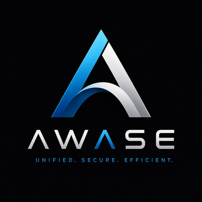

<p align="center">
  
</p>

# Awase

Awase is a unified temporal fabric for FreeBSD: the core of the PGSDF
multimedia system. It brings graphics, sound, and input into one
codebase, with the shared protocols, event formats, session identity,
and timing that make them work as one system.

Its central part is chronofs, which keeps graphics, sound, and input
on the same clock. That clock comes straight from the audio hardware
through audiofs, so the system stays in step by design, not by later
correction.

Awase is built for PGSD on FreeBSD and ships its own kernel
configuration. The name (from Japanese awaseru, to bring together, to
align) was adopted 2026-06-12; the project was formerly named UTF,
and historical documents retain that name as record.

---

## How this project is documented

Different documents answer different questions. Knowing which is
which is most of reading this project:

- **This README** says what Awase is and how it fits together.
- **[`INSTALL.md`](INSTALL.md)** is the end-to-end installation
  walkthrough, including the hazards that have actually broken
  installs.
- **`pgsd-kernel/KERNEL-RECIPE.md`** is the sole path for building
  and installing the PGSD kernel.
- **`BACKLOG.md`** is the single source of truth for the status of
  all work: what is done, in progress, open, and deferred, per
  component and per work stream. **`BACKLOG-history.md`** holds the
  closed chronicle.
- **`docs/adr/`** holds project-level architecture decision records.
  Each subsystem additionally keeps its own design documents and ADRs
  under `<subsystem>/docs/`.

Identifiers you will meet throughout: `AD-n` names an Awase substrate
work stream (tracked in `BACKLOG.md` under Architectural Discipline);
`NDE-`, `LT-`, and `SM-` prefixes name PGSD distribution tracks; and
`ADR nnnn` names a decision record, project-level in `docs/adr/` or
subsystem-level in `<subsystem>/docs/adr/`. Stage and phase letters
(Stage F, Phase 2) are internal to a single work stream and defined
in its proposal document.

---

## The substrate and the distribution

This monorepo holds two architecturally distinct projects that share
one workspace.

**Awase is the substrate:** the kernel modules and userland services
that provide a unified temporal fabric for input, audio, graphics,
and time. Awase has stable contracts (the kernel/userland boundary,
the shared-memory regions under `/var/run/sema/`, the IPC protocols)
that another distribution could in principle adopt to build a
different desktop on top. Awase holds no opinion about users,
sessions, login, or desktop environment; it deals in uids from
`getpeereid(3)` and in surfaces from clients.

**PGSD is the distribution:** a FreeBSD distribution built on Awase,
aimed at scientific and METOC visualization. PGSD makes the choices
Awase deliberately leaves open: the desktop environment (NDE), session
management and login (`pgsd-sessiond`), the application layer (LT),
and the kernel configuration. Another distribution built on Awase
could choose differently in any of these.

The naming shows the split at the process level. Awase kernel modules
use the `*fs` convention (`drawfs`, `inputfs`, `chronofs`,
`audiofs`); Awase userland services use the `sema-` prefix
(`semadrawd`, `semasound`); PGSD components use the `pgsd-` prefix
(`pgsd-sessiond`, with future `pgsd-*d` daemons as the distribution
grows). `ps` output on a PGSD system tells the operator which layer
each process belongs to.

Three distribution-level programs own the boot path and the kernel's
definition: **AD-56** (boot-path ownership: a fresh Awase boot
loader, implemented as **AD-62** in `pgsd-loader/`), **AD-59**
(bootstrap recovery: a loader-stage pipeline in `pgsd-boot/` that
makes the recovery environment reachable without operator loader
knowledge), and **AD-57** (source of truth for the PGSD kernel: a
pinned FreeBSD revision plus project deltas, so a given kernel is
reproducible from the repository). Their designs live in
`docs/design/` and `pgsd-loader/docs/`; their status lives in
`BACKLOG.md`.

The installation architecture is governed by project ADR 0002
(`docs/adr/0002-awase-artifact-contract.md`): building Awase and
installing PGSD are becoming independent systems joined by a
published artifact contract, converging on the Axiom format
(github.com/pgsdf/axiom).

---

## Architecture

```
     Applications                     audio clients
          |                                |
     libsemadraw                       semasound
     (SDCS streams)                 (mixing broker:
          |                      targets, policy, state)
     semadrawd <---- inputfs               |
     (compositor)    (HID kernel        audiofs
          |           substrate)     (kernel audio:
       drawfs             |           PCI HDA, clock
     (/dev/draw)      hardware           writer)
          |           (USB HID)            |
       hardware                      hardware (HDA)
 (EFI framebuffer /
  Vulkan / X11)

   chronofs aligns all three domains against the
   audiofs-written clock at /var/run/sema/clock.
```

| Component | Role |
| --- | --- |
| drawfs | Kernel graphics transport. `/dev/draw` character device, surface lifecycle, mmap-backed pixel buffers, EFI framebuffer blit. |
| semadraw | Semantic rendering. SDCS command streams, the `semadrawd` compositor, software and hardware backends. |
| semasound | Audio mixing broker. Unix-socket clients, named mixing targets, format adaptation and hardware-rate election, policy with reference-counted ducking, state publication under `/var/run/sema/audio/`. Sole writer to `/dev/audiofs0`. |
| inputfs | Kernel input substrate. Attaches at hidbus, parses HID reports, publishes input state and events through shared memory under `/var/run/sema/input/`. The sole input path. |
| audiofs | Kernel audio substrate. Owns the audio hardware end to end (class-matched PCI HDA, vendor-agnostic) and writes the audio clock chronofs reads. |
| chronofs | Temporal coordination layer. Audio-driven frame scheduler, ring buffers, clock publication. |
| shared/ | Protocol constants, event schema, session identity, clock interface, shared by all daemons. |
| semainput | The `libsemainput` gesture library, used by semadrawd. (The historical `semainputd` daemon is retired.) |

---

## Getting started

Awase targets FreeBSD 15.1-RELEASE. The full walkthrough, including
one-time `mac_do` provisioning and the hazards that have actually
broken installs, is [`INSTALL.md`](INSTALL.md). The short form:

```
sh install.sh
```

Run as a regular user, not under `sudo`: the userland build is
unprivileged and only the deploy phase elevates (through `mdo`).
`install.sh` installs the Awase userland, kernel modules, services,
and supervision tree. It does not build the PGSD kernel; that is a
separate, operator-invoked step per `pgsd-kernel/KERNEL-RECIPE.md`
(ADR 0002), and the installer detects the kernel state and says so.
The working order on a fresh machine is: build the kernel, run
`install.sh`, install the kernel, reboot.

**One-time `mac_do` provisioning (do this first).** `install.sh`
elevates privileged steps through `mdo` (mac_do) by default, but it
cannot provision `mac_do` itself: provisioning needs root, and the
whole point of the installer is that it runs unprivileged, so this is
a chicken-and-egg the installer leaves to you. Once, in a root shell
(`su -`, or the system console):

```
kldload mac_do
sysrc -f /boot/loader.conf mac_do_load=YES
sysctl security.mac.do.rules='gid=0>uid=0,gid=*,+gid=*'
echo 'security.mac.do.rules=gid=0>uid=0,gid=*,+gid=*' >> /etc/sysctl.conf
```

If `id` does not show the `wheel` group for your user, also run (then
re-login):

```
pw groupmod wheel -m "$(id -un)"
```

Alternatively, skip `mac_do` entirely and run the installer with
`sudo` as the elevator: `PRIV=sudo sh install.sh` (this needs a
working sudoers entry for your user). Either way `install.sh` probes
that elevation actually works before any privileged step and prints
this same guidance if it does not.

Two system-level settings matter:

**`/var/run` must be tmpfs.** Awase publishes state to userland
through shared-memory regions under `/var/run/sema/` (the audio
clock, the session token, the inputfs state region). These files are
recreated on every daemon or module load and mean nothing beyond the
current boot. The supported configuration mounts `/var/run` as tmpfs:

```
tmpfs /var/run tmpfs rw,mode=755 0 0
```

in `/etc/fstab`, then reboot or `mount /var/run`. `install.sh`
ensures this itself, so on an installer-driven setup the manual
mount is belt-and-braces. Running on a non-tmpfs `/var/run` is
unsupported.

**The PGSD kernel.** Stock GENERIC compiles in HID and console
drivers that claim the devices inputfs and drawfs need, so a GENERIC
system can stage Awase but not run it. The PGSD kernel omits those
drivers; build and install it per `pgsd-kernel/KERNEL-RECIPE.md`.

**Developer builds.** Each subsystem builds on its own; the root
`zig build` and `build.sh` aggregate the userland subprojects. The
userland requires Zig 0.16 (vendored at `sdk/zig/current`); the
kernel modules require FreeBSD kernel sources at `/usr/src`:

```
cd semadraw  && zig build
cd semasound && zig build
cd chronofs  && zig build
cd drawfs    && ./build.sh build && ./build.sh load
```

**Run the stack.** On a deployed system the stack is supervised and
starts at boot; use the `service` interface (`service semasound
status`, `service semadraw restart`, and so on).

**Run the terminal emulator by hand:**

```
sudo semadraw/zig-out/bin/semadraw-term            # auto-detects display size
sudo semadraw/zig-out/bin/semadraw-term --scale 2  # HiDPI
sudo semadraw/zig-out/bin/semadraw-term --scale 4  # 4K/5K
```

---

## Repository layout

```
awase/
├── drawfs/          kernel graphics module and protocol
├── inputfs/         kernel input substrate
├── audiofs/         kernel audio substrate
├── semadraw/        semantic rendering daemon and client library
├── semasound/       audio mixing broker
├── semainput/       libsemainput gesture library
├── shared/          cross-cutting constants, schema, and interfaces
├── chronofs/        temporal coordination layer
├── pgsd-sessiond/   PGSD: graphical login daemon
├── pgsd-kernel/     PGSD: kernel config and build recipe
├── pgsd-loader/     PGSD: the fresh Awase boot loader (AD-62)
├── pgsd-boot/       PGSD: recovery bootstrap pipeline (AD-59)
├── s6/              Awase supervision tree, installed to /var/service/awase/
├── scripts/         devfs rulesets, periodic jobs, bench helpers
├── BACKLOG.md       consolidated project status and backlog (source of truth)
├── BACKLOG-history.md  archive of closed entries and historical records
└── docs/
    ├── adr/         project-level architecture decision records
    ├── design/      AD-56/57/59 and other design documents
    └── sessions/    per-session working memos
```

---

## Subsystems

Each subsystem's own `docs/` directory carries its specifications,
ADRs, and history; the paragraphs here are orientation only.

### drawfs

A FreeBSD kernel module that exposes `/dev/draw`. Clients open the
device, negotiate over a binary framed protocol, create surfaces
backed by swap memory, map them with `mmap(2)`, render into the pixel
buffer, and present. The kernel is not a compositor; policy lives in
userspace.

The module maps the UEFI GOP framebuffer at load time, so semadrawd
can render straight to the physical display on bare-metal FreeBSD
with no GPU driver; verified on Intel Bay Trail (1024x768) and the
Apple iMac (3840x2160). DRM/KMS support is a skeleton, gated behind
`DRAWFS_DRM_ENABLED` at build time and strictly optional; the EFI
framebuffer path is the default bare-metal display path.

See `drawfs/docs/` for the protocol specification, architecture, and
build instructions.

### semadraw

A userspace semantic graphics system. Applications link against
`libsemadraw` and produce SDCS (Semantic Draw Command Streams):
binary sequences of drawing operations that express intent rather
than GPU commands. `semadrawd` owns surface composition and
presentation. Backends include software (the reference), Vulkan,
DRM/KMS, X11, Wayland, and drawfs.

`semadraw-term` is a native terminal emulator built on libsemadraw:
multi-session (up to 8), VT100/xterm-256color emulation, display-size
auto-detection, and font scaling for HiDPI. It runs on bare metal
through the drawfs EFI framebuffer backend and under Xorg through the
X11 backend.

See `semadraw/docs/` for the SDCS specification, architecture, and
API overview.

### semasound

The audio mixing broker. Clients connect over the Unix socket at
`/var/run/sema/audio.sock`, identify with a Hello header (format,
target, label, class), and stream PCM. The broker mixes per named
target, adapts formats with a windowed-sinc resampler, elects the
hardware rate per session opener for bit-exact passthrough, enforces
the policy grammar (allow, deny, override-as-ducking, group
exclusivity, admission fallback) with live reload, and publishes
state under `/var/run/sema/audio/`. It runs s6-supervised and starts
at boot; `semasound-tone` and `semasound-dump` are its test client
and read-only inspector.

See `semasound/docs/SUPERVISION.md` for operation and
`audiofs/docs/adr/` for the decision record it implements.

### inputfs

A FreeBSD kernel module that owns the HID input path. inputfs
attaches at `hidbus`, parses HID report descriptors, registers
interrupt callbacks, and publishes input state and events to
userspace through shared-memory regions under `/var/run/sema/input/`:
a state region (current pointer position, device inventory,
per-device keyboard and touch state, updated under a seqlock) and an
event ring (an ordered delta stream read through the
`EventRingReader` in `shared/src/input.zig`). It is the sole input
path; no Awase code path uses evdev, by deliberate commitment to the
discipline at `docs/AWASE_ARCHITECTURAL_DISCIPLINE.md`.

inputfs also feeds FreeBSD's `vt(4)` console keyboard input through
a bridge driver: each HID keyboard becomes a slave of `kbdmux`, so
console login at ttyv0 works on a PGSD kernel that loads no legacy
hkbd. The bridge is gated by `hw.inputfs.kbdmux_bridge` (default 1).

See `inputfs/docs/` for the proposal, foundations, ADRs, byte-level
specs, and verification protocols.

### audiofs

A FreeBSD kernel module that owns audio hardware end to end: the
audio-side counterpart to inputfs. It is a direct PCI driver that
class-matches on PCI HDA controllers (vendor-agnostic: any HDA
controller attaches through the same probe), replacing FreeBSD's
`snd(4)` framework in the PGSD kernel in full. It is also the
kernel-side writer of the audio hardware clock that chronofs reads,
which closes the temporal fabric on the side it originates from.

See `audiofs/docs/adr/` for the decision record and
`audiofs/docs/audiofs-proposal.md` for the design.

### chronofs

The temporal coordination layer that makes time a first-class
addressable medium across the subsystems. The audio hardware clock
drives a shared monotonic counter; every event carries an
audio-sample timestamp; the frame scheduler queries scene state at a
target audio position rather than at wall time, which produces
drift-free AV synchronization by construction. `chrono_dump` is its
diagnostic tool.

See `docs/Thoughts.md` for the full design.

### shared/

Protocol constants for the binary protocols (drawfs, semadraw IPC,
SDCS) in a single JSON source of truth, with a code generator that
emits C headers and Zig declarations; plus the unified event schema,
session identity module, and clock publication interface used by all
daemons.

### semainput

The `libsemainput` gesture library (two-finger scroll, pinch,
three-finger swipe, drag, tap), used directly by semadrawd. The
historical `semainputd` evdev daemon is retired; `semainput/docs/`
describes it for the design record and describes nothing currently
running.

---

## Multi-user deployment

Awase's substrate publication files default to mode `0600`, owned by
`root:wheel`, per ADR 0013
(`inputfs/docs/adr/0013-publication-permissions.md`). On a
single-user dev or bench system, no further configuration is needed:
all Awase daemons run as root by default, all consumers reach the
substrate by elevating (through `mdo`, or `sudo` if you prefer), and
the substrate is uniformly accessible within that root context.

On a multi-user system, operators relax the defaults through the
operating system rather than through Awase-specific configuration.
Two layers control the result.

**Kernel-side (`inputfs`).** Three sysctl tunables apply at module
load and at runtime:

```
sysctl hw.inputfs.dev_uid=0
sysctl hw.inputfs.dev_gid=$(getent group operator | cut -d: -f3)
sysctl hw.inputfs.dev_mode=0640
```

These can also live in `/boot/loader.conf` for boot-time defaults:

```
hw.inputfs.dev_uid=0
hw.inputfs.dev_gid=920
hw.inputfs.dev_mode=0640
```

The sysctls take effect for files created after the change.
Already-open files keep the attributes they were created with.
Reload the inputfs module to refresh.

**Userspace daemons.** The daemons run under s6 supervision; their
process identity and umask are set in the s6 run scripts under
`s6/awase/<name>/run` (installed to `/var/service/awase/` by
install.sh), not through rc.conf user/group variables. install.sh
creates the `_semadraw` system user for the compositor's privilege
separation. A umask in a run script combines with the explicit modes
Awase passes to `createFile`: `umask 027` with `0o600` yields `0600`;
`umask 037` with `0o640` yields group-readable `0640`. Awase can
never expose more permission than its explicit mode, so the umask
only ever restricts further.

Add authorized consumers to the chosen group with `pw groupmod
operator -m <user>`. The user can then run `inputdump`,
`chrono_dump`, and similar diagnostic tools without `sudo`.

drawfs's cdev follows the same convention with parallel sysctls
(`hw.drawfs.dev_uid`, `hw.drawfs.dev_gid`, `hw.drawfs.dev_mode`).

---

## Graphics backends

| Backend | Use case | Requirements |
| --- | --- | --- |
| drawfs (EFI) | Bare-metal FreeBSD console | UEFI firmware, drawfs.ko loaded |
| X11 | FreeBSD with Xorg | libX11 |
| Vulkan | GPU-accelerated rendering | Vulkan driver |
| software | Testing and reference | None |
| DRM/KMS | Optional GPU modesetting | drm-kmod, build with DRAWFS_DRM_ENABLED |

The EFI framebuffer path works on any UEFI machine, whatever the GPU
age or driver availability, including hardware with no Vulkan support
and no working drm-kmod port.

---

## Status

**The substrate is complete and in service.** Input runs on inputfs
alone, audio on audiofs and semasound alone, and the clock on the
audiofs kernel writer, all of it supervised from boot. The upper
layers (NDE, LT, the rest of SM) are the next frontier, by choice of
priority; the installation and packaging path is moving under
project ADR 0002 to a published artifact contract.

Detailed status, per component and per work stream, with dates and
milestone ledgers, lives in **`BACKLOG.md`** (see its Project Status
section); the closed chronicle lives in `BACKLOG-history.md`.

---

## License

MIT License. See `LICENSE`.

Copyright (c) 2026 Pacific Geoscience Systems Development Foundation.

Vendored third-party code under `inputfs/test/fuzz/vendored/`
(NetBSD-derived HID parsing used by the fuzzing harness) retains its
original BSD-2-Clause license and copyright headers.
